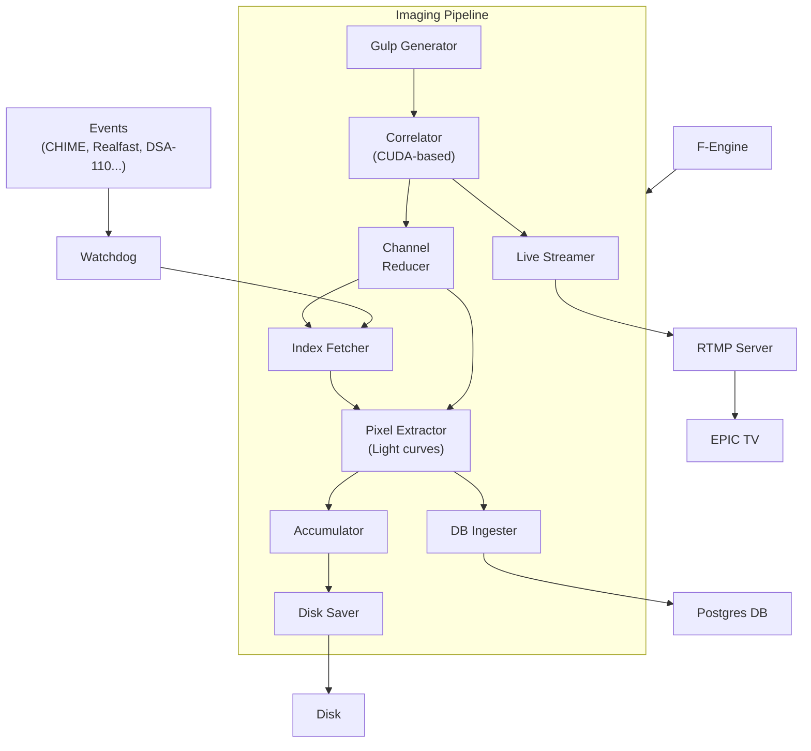

The EPIC Imager is an all-sky radio imaging system built for realtime operations. EPIC stands for E-field Parallel Imaging Correlator algorithm ([Thyagarajan et al. 2017](%5Bhttps://academic.oup.com/mnras/article/467/1/715/2917985%5D\(https://academic.oup.com/mnras/article/467/1/715/2917985\))), which transforms the observed electric fields directly into sky-images without calculating *visibilities*. This direct transformation makes EPIC computationally far less intensive compared to regular imaging. The imager code is mainly written in C++17 with occasional calls to python modules. The pipeline takes the data from the F-engine through several transformative stages to produce multiple data products including FITS images, light curves and live video streams. Each stage in the pipeline, for example, accumulation, is implemented as a kernel using the [Raftlib C++](https://github.com/RaftLib/RaftLib) library, although the actual correlator code is implemented using [CUDA](https://developer.nvidia.com/cuda-toolkit). Raft provides lock-free queues to efficiently transfer data between kernels. Any non-primitive data types, for instance, images or E-field spectra, are transferred using lock-free buffers pools. The flowchart below shows the data flow in the EPIC imaging pipeline along with its external components.



Packets from the F-Engine are buffered for a specified duration and grouped into *gulps*, and are sent to the GPU for imaging. The images are transferred to the live stream, and are also further reduced for disk saving and light curve extraction purposes. The imager also periodically fetches sources currently in the field of view from the watchdog to extract their light curves. The watchdog keeps track of all the sources of interest (pulsars, FRBs etcetera).

## Implementation Overview

The main entrypoint into the imaging pipeline is through the <SwmToken path="/src/raft_kernels/epic_executor.hpp" pos="144:2:2" line-data="void RunEpic(int argc, char** argv) {">`RunEpic`</SwmToken> function. It initializes an <SwmToken path="/src/raft_kernels/epic_executor.hpp" pos="125:2:2" line-data="class EPIC : public EPICKernels&lt;_nthGPU - 1&gt; {">`EPIC`</SwmToken>object which recursively creates instances of <SwmToken path="/src/raft_kernels/epic_executor.hpp" pos="35:2:2" line-data="class EPICKernels {">`EPICKernels`</SwmToken> class. Each instance (total number set by `--ngpus` option) runs a separate pipeline on a dedicated GPU. We use one RTX 4090 GPU per node for operations at the LWA Sevilleta station in New Mexico. To add a new kernel to the pipeline, create a kernel member in the <SwmToken path="/src/raft_kernels/epic_executor.hpp" pos="35:2:2" line-data="class EPICKernels {">`EPICKernels`</SwmToken> class and initialize it in the constructor.

<SwmSnippet path="/src/raft_kernels/epic_executor.hpp" line="35">

---

Adding the kernel object as a private member. The suffix `_kt` indicates a kernel type.

```c++
class EPICKernels {
 private:
  std::unique_ptr<Streamer> m_streamer;
  bool m_is_offline{false};
  static constexpr unsigned int m_nkernels{9};
  PktGen_kt m_pkt_gen;
  DummyPktGen_kt m_dpkt_gen;
  EPICCorrelator_kt m_correlator;
```

---

</SwmSnippet>

After initialization, each kernel, which is run on a separate thread, is bound to a dedicated core before adding it to the Raft <SwmToken path="/src/raft_kernels/epic_executor.hpp" pos="52:6:6" line-data="  raft::map* m_map;">`m_map`</SwmToken>. This map defines a directed acyclic graph for executing the pipeline.

<SwmSnippet path="/src/raft_kernels/epic_executor.hpp" line="53">

---

Binding kernel to a core

```c++
  void BindKernels2Cpu(const KernelTypeDefs::opt_t& p_options) {
    // use an additional offset of 2 for the runtime
    constexpr unsigned int cpu_ofst = (_GpuId)*m_nkernels + 2;
    // ensure the cpu ID is always non-zero.
    // Setting it to zero causes instability
    if (m_is_offline) {
      RftManip<1 + cpu_ofst, 1 + _GpuId>::bind(m_dpkt_gen);
    } else {
      RftManip<1 + cpu_ofst, 1 + _GpuId>::bind(*(m_pkt_gen.get()));
    }
    RftManip<2 + cpu_ofst, 1 + _GpuId>::bind(m_correlator);
```

---

</SwmSnippet>

Kernels can be joined using the `>>` operator. See <SwmLink doc-title="Creating a Raft Kernel">[Creating a Raft Kernel](/.swm/creating-a-raft-kernel.hr4rzvt1.sw.md)</SwmLink> for details. The code below shows the initial part of the pipeline buildup where the data flows from packet assembler to the pixel extractor.

<SwmSnippet path="/src/raft_kernels/epic_executor.hpp" line="73">

---

Adding a kernel to the pipeline

```c++
  void InitMap(const KernelTypeDefs::opt_t& p_options) {
    auto& m = *m_map;
    // m += m_dpkt_gen >> m_correlator >> m_disk_saver;
    if (m_is_offline) {
      m += m_dpkt_gen >> m_correlator["gulp"]["img"] >>
           m_chan_reducer["in_img"]["out_img"] >> m_pixel_extractor["in_img"];
    } else {
      m += *(m_pkt_gen.get()) >> m_correlator["gulp"]["img"] >>
           m_chan_reducer["in_img"]["out_img"] >> m_pixel_extractor["in_img"];
    }
    m += m_correlator["img_stream"] >> m_live_streamer["in_img"];
```

---

</SwmSnippet>

Values in the brackets indicate the input and output ports of the kernels. Each kernel defines input and output ports to communicate with other kernels. For example, the correlator kernel defines one input port `gulp` that receives data from the packet assembler. It also defines two output ports `img` and `img_stream`that transmits images to the channel reducer and the live streamer, respectively.

All the kernel types are defined in the <SwmPath>[src/raft_kernels/kernel_types.hpp](/src/raft_kernels/kernel_types.hpp)</SwmPath> file. Types defined using the <SwmToken path="/src/raft_kernels/kernel_types.hpp" pos="63:2:2" line-data="struct KernelTypeDefs {">`KernelTypeDefs`</SwmToken> struct, and we specialize a <SwmToken path="/src/raft_kernels/kernel_types.hpp" pos="82:3:3" line-data="  ktype get_kernel();">`get_kernel`</SwmToken> template function to return a kernel object. For instance, the following snippet shows the definition of <SwmToken path="/src/raft_kernels/kernel_types.hpp" pos="192:2:2" line-data="using EpicLiveStream_kt = Kernel&lt;_LIVE_STREAMER&gt;::ktype;">`EpicLiveStream_kt`</SwmToken>, which is an alias for the <SwmToken path="/src/raft_kernels/epic_live_streamer.hpp" pos="40:2:2" line-data="class EpicLiveStream : public raft::kernel {">`EpicLiveStream`</SwmToken> kernel, and its getter function.

<SwmSnippet path="/src/raft_kernels/kernel_types.hpp" line="183">

---

Defining a kernel type for <SwmToken path="/src/raft_kernels/epic_executor.hpp" pos="35:2:2" line-data="class EPICKernels {">`EPICKernels`</SwmToken> class

```c++
template <>
struct Kernel<_LIVE_STREAMER> : KernelTypeDefs {
  using ktype = EpicLiveStream<payload_float_t>;
  template <unsigned int _GpuId>
  static ktype get_kernel(const opt_t& options) {
    return ktype();
  }
};

using EpicLiveStream_kt = Kernel<_LIVE_STREAMER>::ktype;
```

---

</SwmSnippet>

The `_GpuId`is a template parameter that indicates the ID of the GPU device that executes the pipeline.

The Imager code also uses python modules for a few operations including calculating antenna positions and phases, generating gridding kernels, talking to the ADP, among others. Although the same operations can be performed in C++, using python simplifies coding for these one-time calculations using libraries such as `scipy`without re-compiling the code. The imager uses [pybind11](https://github.com/pybind/pybind11) library to invoke python functions from the C++ code. The code below shows how to fetch ADP start time from the unix epoch by calling a python function.

<SwmSnippet path="/src/ex/py_funcs.hpp" line="326">

---

Calling a python function from C++ using pybind11

```c++
double GetAdpTimeFromUnixEpoch() {
  py::gil_scoped_acquire acquire;
  return py::module_::import("epic_utils")
      .attr("get_ADP_time_from_unix_epoch")()
      .cast<double>();
}
```

---

</SwmSnippet>

### Code Organization

The raft kernel definitions are located in <SwmPath>[src/raft_kernels](/src/raft_kernels)</SwmPath> folder and their related definitions in <SwmPath>[src/ex](/src/ex)</SwmPath> folder. Because the majority of the code is templatized, classes are declared and defined in `hpp` files in the <SwmPath>[src/ex](/src/ex)</SwmPath> folder. Python modules are located in <SwmPath>[src/python](/src/python)</SwmPath> and their C++ counterparts in the <SwmPath>[src/ex/py_funcs.hpp](/src/ex/py_funcs.hpp)</SwmPath> file. Shell scripts to start the imaging pipline and overclock the GPU are in the <SwmPath>[src/commands](/src/commands)</SwmPath> folder. All external dependencies like `glog` and `pqxx` are included as submodules to the imaging project and are placed in the <SwmPath>[src/extern](/src/extern)</SwmPath> folder. Finally, the pipeline is built using `CMake`. The CPU and GPU codes are compiled separately and are the linked to the executable. See <SwmPath>[CMakeLists.txt](/CMakeLists.txt)</SwmPath> for details.

## Further Reading

**Code Walkthroughs**: Documents in the `code walkthroughs`folder provides implementation details on all the data flows that happen in the imager. Where necessary they also provide tips on extending the code.

**Tutorials:** The `tutorials` folder provides tutorials on adding new features to the code, for instance, building new kernels. It also provides details on debugging the code and lists several *gotchas* that previously led to severe bugs.

<SwmMeta version="3.0.0" repo-id="Z2l0aHViJTNBJTNBTFdBX0VQSUMlM0ElM0FlcGljLWFzdHJvbm9teQ==" repo-name="LWA_EPIC"><sup>Powered by [Swimm](https://app.swimm.io/)</sup></SwmMeta>
